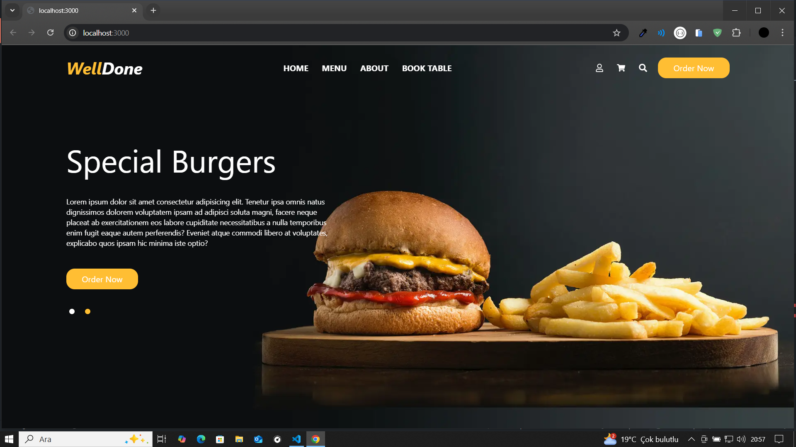

## What is WellDone ?

WellDone is a cloud based food order web abblication.

## Used Technologies

Next JS
Tailwind CSS
Node JS
Mongo DB

## Proccessing

## Header and Search Components

Header and Search components has created.
Search modal has includes an input field and searched item list

## Slider Component

The slider component has created. The react slick package was used to create the slider.

## Campaigns and Menu Section

Campaigns and Menu section has includes adventage and discount
menus.
On the other hand menu section has contains all products restaurant do.
The customer can access the type of food
He or She wants from the relevant menu.

## About Page

Some informations about the WellDone restaurant management web service

## Products Page

The page provides choice the meals and size of it
Clients has can online booking their meals

## Booking Section

Clients has can online booking any time from any where.
On the other side clients would like to come restaurant,
They can direct address of restaurant on the map.
Formik and Yup form validation packages has added in project.

## Testimonials / Clients Review

In this part of the project, the react slick package was used, as in the header section.

## Footer Component

Footer component has created. Users has can reach social media links
and addresses.

## Auth Pages

Login,Register and Admin Login pages has created.
User can be create an account then login.
on the other hand if user wants to be manage his/her order
He/She can reach orders at the admin page.
He/She can manage to orders on one panel with easily

### Login Page Screen Shot

### Register Page Screen Shot

### Admin Login Page Screen Shot

